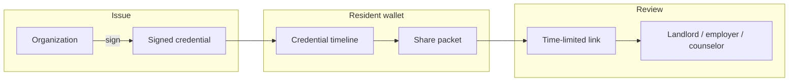

# Anchor

**A resident-controlled verified record — not a score someone else assigns.**

Anchor is a local-first reputation wallet built for [Milpitas Hacks](https://github.com/oboy10/milpitas-hacks). Shelters, landlords, employers, and caseworkers issue **cryptographically signed credentials**. Residents own the timeline, choose what to share, and hand reviewers a time-limited packet — nothing more.

**Live demo:** [anchor.lahs.win](https://anchor.lahs.win) · [milpitas-hacks-red.vercel.app](https://milpitas-hacks-red.vercel.app)

---

## Why Anchor exists

People rebuilding stability often have positive records scattered across programs, landlords, and employers — but no portable way to prove them. Background checks and opaque scores hide context and take control away from the person the record is about.

Anchor flips that:

- **Residents hold the wallet** — Ed25519 identity, password-protected, stored only in the browser.
- **Issuers sign facts, not ratings** — “12 months on-time rent,” not a hidden number.
- **Sharing is selective** — Residents pick credentials, add optional notes, and send a link that expires.
- **Verification is public** — Anyone with a share link can confirm signatures without an account.

---

## How it works



1. **Organizations issue** — Sign a credential by email, offline file, or in response to a resident request.
2. **Residents curate** — Review the timeline, add personal notes, build packets.
3. **Reviewers verify** — Open a share link; Anchor checks Ed25519 signatures and shows only what was selected.

---

## Features

| Feature | Description |
| --- | --- |
| **Local-first wallet** | All credentials, packets, and keys live in `localStorage` / `sessionStorage` on the resident's device. |
| **Email credentials** | Issuers send to a verified email; credentials sync into the resident's wallet automatically. |
| **Request by email** | Residents request a credential from an organization; the issuer gets a sign link. |
| **Offline credentials** | Issuers download a `.anchor` file; residents import it — no server required. |
| **Share packets** | Bundle selected credentials into a link (or email/SMS) with an expiry date. |
| **Public verify** | `/verify` validates signatures and packet contents for third parties. |
| **Identity verification** | Email (Resend) and phone (Twilio) verification with signed identity vouches. |
| **Account portability** | Export/import `.anchor` archives and encrypted account vaults. |

---

## Architecture

Anchor is **local-first**. The server never holds wallet data.

```
Browser (resident / issuer)
├── Ed25519 keypair + encrypted vault     → localStorage
├── Unlocked signing session              → sessionStorage (per tab)
├── Credential ledger + share packets     → localStorage
└── WebCrypto sign / verify               → client-side only

Server (Firebase Admin + Next.js API routes)
├── SHA-256 contact hashes                → Firestore (no plaintext PII)
├── Pending verification codes            → Firestore (hashed, short TTL)
├── Credential delivery inbox             → Firestore (until accepted)
├── Credential request tokens             → Firestore (issuer fulfill links)
└── Email / SMS delivery                  → Resend / Twilio
```

Firestore rules deny all direct client access. Every server write goes through the Admin SDK.

---

## Quick start

**Requirements:** Node.js 20+, npm

```bash
git clone https://github.com/oboy10/milpitas-hacks.git
cd milpitas-hacks
npm install
cp .env.example .env.local
npm run dev
```

Open [http://localhost:3000](http://localhost:3000).

Without Firebase Admin credentials the app still runs locally using in-memory fallbacks for verification and credential delivery. Email and SMS require provider keys.

---

## Environment variables

Copy `.env.example` to `.env.local` and fill in what you need.

| Variable | Required for | Notes |
| --- | --- | --- |
| `NEXT_PUBLIC_FIREBASE_*` | Firebase client SDK | Safe to expose in the browser |
| `FIREBASE_PROJECT_ID` | Server features | Service account |
| `FIREBASE_CLIENT_EMAIL` | Server features | Service account |
| `FIREBASE_PRIVATE_KEY` | Server features | PEM with `\n` newlines in `.env` |
| `RESEND_API_KEY` | Email delivery | [Resend](https://resend.com/api-keys) |
| `RESEND_FROM` | Email delivery | Must use a [verified domain](https://resend.com/domains) |
| `NEXT_PUBLIC_APP_URL` | Email links | e.g. `https://anchor.lahs.win` (include protocol in production) |
| `TWILIO_*` | SMS + phone verify | Optional |
| `ANCHOR_PROVIDER_KEYS` | Custom issuer keys | JSON map `fingerprint → hex seed`; demo keys used if unset |
| `ANCHOR_VERIFIER_PRIVATE_KEY` | Identity vouches | Demo wallet derived if unset |

**Vercel tip:** paste the service account `private_key` as one line with `\n` between PEM lines, or paste the multiline PEM directly — no extra quotes in the Vercel UI.

Sync local env to Vercel after `vercel login` and `vercel link`:

```bash
npm run vercel:env
```

---

## Routes

| Route | Who | Purpose |
| --- | --- | --- |
| `/` | Public | Landing page |
| `/sign-in` | Anyone | Create or unlock a local account |
| `/wallet` | Resident | Credential timeline and inbox sync |
| `/wallet/packets` | Resident | Build and manage share packets |
| `/wallet/issue` | Issuer | Sign credentials (email or offline) |
| `/wallet/identity` | Signed-in user | Profile, email/phone verification |
| `/wallet/verify` | Signed-in user | Upload and verify `.anchor` bundles |
| `/credential/sign` | Issuer | Public sign page (email request links) |
| `/credential/accept` | Resident | Accept a credential delivered by email |
| `/verify` | Public | Open a resident's share link |
| `/accounts` | Signed-in user | Manage multiple local accounts |
| `/provider` | Issuer | Issuance console |
| `/admin` | Dev | Inspect local ledger state |

---

## Credential delivery

Three paths coexist:

### Email (online)

1. Resident verifies email at sign-up or on Edit profile.
2. Resident clicks **Request credential** or issuer enters recipient email on Issue.
3. Issuer signs → credential lands in resident inbox → wallet auto-syncs.

### Offline (no server)

1. Resident opens **Offline credential → Copy issue link**.
2. Issuer opens link, signs, downloads `.anchor` file.
3. Resident uploads the file under **Offline credential → Upload credential file**.

### Share packets

1. Resident selects credentials → **Build packet**.
2. Send via copy link, email, SMS, or download `.anchor` archive.
3. Reviewer opens `/verify?token=…` — no account needed.

---

## Firestore collections

Server-side data is minimal and hashed where possible:

| Collection | Purpose |
| --- | --- |
| `registeredEmails/{hash}` | SHA-256 email hashes (backup registry) |
| `pendingVerifications/{hash}` | Hashed verification codes (~10 min TTL) |
| `contactDirectory/{hash}` | Verified email/phone → wallet fingerprint |
| `credentialDeliveries/{token}` | Pending signed credentials for email inbox |
| `credentialRequests/{token}` | Resident → issuer request fulfill links |

Deploy rules and indexes:

```bash
npm run firestore:deploy
# or
npm run firebase:deploy-rules
```

Legacy collections from earlier prototypes can be removed with:

```bash
npm run firebase:cleanup
```

---

## Crypto model

- **Identity:** Ed25519 keypair; fingerprint = first 8 bytes of `SHA-512(publicKey)` as hex.
- **Credential:** Signed attestation `{ from, to, properties, nonce }` + signature.
- **Vault:** Account seed encrypted with scrypt + AES-256-GCM (password-protected).
- **Portable files:** `.anchor` binary archives (attestations + public signer keys).

Private keys never touch Firestore. Tampering with an attestation breaks signature verification.

Protocol details: [`lib/anchor/protocol/README.md`](lib/anchor/protocol/README.md)

---

## Deploy on Vercel

1. Import this repo on [Vercel](https://vercel.com).
2. Set environment variables (see table above).
3. Build command defaults to `npm run vercel-build` (deploys Firestore rules, then `next build`).

Pushing to `main` triggers a production deploy if the repo is connected.

---

## Scripts

| Command | Description |
| --- | --- |
| `npm run dev` | Dev server (webpack) |
| `npm run build` | Production build |
| `npm run start` | Run production server locally |
| `npm run lint` | ESLint |
| `npm run test:anchor` | Anchor protocol unit tests |
| `npm run test:sms` | SMS helper tests |
| `npm run firestore:deploy` | Deploy rules + indexes via service account |
| `npm run firebase:cleanup` | Remove legacy Firestore collections |

---

## Project structure

```
app/                    Next.js App Router pages and API routes
  (local)/              Wallet, sign-in, accounts (AuthProvider)
  credential/           Public sign + accept flows
  api/                  Verification, credential delivery, share email
components/             UI, wallet, credential signer, packets
lib/
  local/                Browser store, actions, portable import/export
  crypto/               Ed25519 attestations, vault, .anchor archives
  anchor/protocol/      Framework-agnostic signing + verification
  credential-delivery/  Email inbox server logic
  credential-requests/  Request-by-email server logic
  verification/         Email/phone verification codes
  email/                Resend templates
firestore.rules         Deny-all client access; Admin SDK only
```

---

## Testing

```bash
npm run test:anchor
npm run test:sms
```

---

## Status

Built during **Milpitas Hacks** as a working prototype, now open-sourced for learning and iteration. This is not a certified identity provider or legal record system — treat it as a demonstration of resident-owned, verifiable credentials with minimal server trust.

**Stack:** Next.js 16 · React 19 · TypeScript · Tailwind CSS 4 · Firebase Admin · Resend · Twilio · WebCrypto (Ed25519)

---

## License

No license file is included yet. Contact the repository owner before using this code in production.
