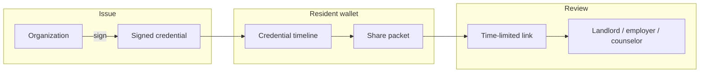

# Anchor

**A resident-controlled verified record — not a score someone else assigns.**

Anchor is a local-first reputation wallet built for [Milpitas Hacks](https://github.com/oboy10/milpitas-hacks). Shelters, landlords, employers, and caseworkers issue **cryptographically signed credentials**. Residents own the timeline, choose what to share, and hand reviewers a time-limited packet — nothing more.

**Live demo:** [anchor.lahs.win](https://anchor.lahs.win)
---

## Why Anchor exists

People rebuilding stability often have positive records scattered across programs, landlords, and employers — but no portable way to prove them. Background checks and opaque scores hide context and take control away from the person the record is about.

Anchor flips that:

- **Residents hold the wallet** — Ed25519 identity, password-protected, stored only in the browser.
- **Issuers sign facts, not ratings** — “12 months on-time rent,” not a hidden number.
- **Sharing is selective** — Residents pick credentials, add optional notes, and send a link that expires.
- **Verification is public** — Anyone with a share link can confirm signatures without an account.

---

## How it works

1. **Organizations issue** — Sign a credential by email, offline file, or in response to a resident request.
2. **Residents curate** — Review the timeline, add personal notes, build packets.
3. **Reviewers verify** — Open a share link; Anchor checks Ed25519 signatures and shows only what was selected.

---

## Features

| Feature | Description |
| --- | --- |
| **Local-first wallet** | All credentials, packets, and keys live in `localStorage` / `sessionStorage` on the resident's device. |
| **Email credentials** | Issuers send to a verified email; credentials sync into the resident's wallet automatically. |
| **Request by email** | Residents request a credential from an organization; the issuer gets a sign link. |
| **Offline credentials** | Issuers download a `.anchor` file; residents import it — no server required. |
| **Share packets** | Bundle selected credentials into a link (or email/SMS) with an expiry date. |
| **Public verify** | `/verify` validates signatures and packet contents for third parties. |
| **Identity verification** | Email (Resend) and phone (Twilio) verification with signed identity vouches. |
| **Account portability** | Export/import `.anchor` archives and encrypted account vaults. |

---

## Architecture

Anchor is **local-first**. The server never holds wallet data.

## Credential delivery

Three paths coexist:

### Email (online)

1. Resident verifies email at sign-up or on Edit profile.
2. Resident clicks **Request credential** or issuer enters recipient email on Issue.
3. Issuer signs → credential lands in resident inbox → wallet auto-syncs.

### Offline (no server)

1. Resident opens **Offline credential → Copy issue link**.
2. Issuer opens link, signs, downloads `.anchor` file.
3. Resident uploads the file under **Offline credential → Upload credential file**.

### Share packets

1. Resident selects credentials → **Build packet**.
2. Send via copy link, email, SMS, or download `.anchor` archive.
3. Reviewer opens `/verify?token=…` — no account needed.

---

## Firestore collections

Server-side data is minimal and hashed where possible:

| Collection | Purpose |
| --- | --- |
| `registeredEmails/{hash}` | SHA-256 email hashes (backup registry) |
| `pendingVerifications/{hash}` | Hashed verification codes (~10 min TTL) |
| `contactDirectory/{hash}` | Verified email/phone → wallet fingerprint |
| `credentialDeliveries/{token}` | Pending signed credentials for email inbox |
| `credentialRequests/{token}` | Resident → issuer request fulfill links |

## Crypto model

- **Identity:** Ed25519 keypair; fingerprint = first 8 bytes of `SHA-512(publicKey)` as hex.
- **Credential:** Signed attestation `{ from, to, properties, nonce }` + signature.
- **Vault:** Account seed encrypted with scrypt + AES-256-GCM (password-protected).
- **Portable files:** `.anchor` binary archives (attestations + public signer keys).

Private keys never touch Firestore. Tampering with an attestation breaks signature verification.

Protocol details: [`lib/anchor/protocol/README.md`](lib/anchor/protocol/README.md)

## Status

Built during **Milpitas Hacks** as a working prototype, now open-sourced for learning and iteration. This is not a certified identity provider or legal record system — treat it as a demonstration of resident-owned, verifiable credentials with minimal server trust.

**Stack:** Next.js 16 · React 19 · TypeScript · Tailwind CSS 4 · Firebase Admin · Resend · Twilio · WebCrypto (Ed25519)

---

## License

No license file is included yet. Contact the repository owner before using this code in production.
